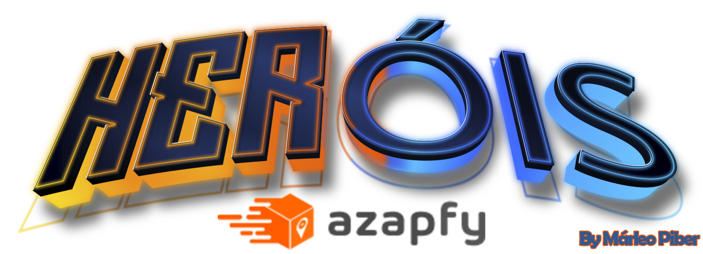

# `Teste Azapfy`

Atividade Frontend Azapfy

# `Link`

https://marleo-azapfy.vercel.app/

# `Descrição`

- Desenvolvimento em NextJS: eu criei a página do desafio técnico usando o framework NextJS, que é uma tecnologia popular para construir aplicativos web com React;
- Linguagens e bibliotecas utilizadas: Utilizei JavaScript para escrever a lógica do aplicativo, styled-components e Material UI para estilização dos componentes, CSS para estilização adicional, e HTML para a estrutura básica da página;
- Padronização de cores: Criei um arquivo chamado colors.jsx para padronizar as cores usadas no projeto. Isso ajuda a manter a consistência visual em todo o site;
- Cards dinâmicos: A partir da requisição via API Rest, são renderizados cards que exibem informações sobre heróis;
- Paginação funcional: Implementei a funcionalidade de paginação, permitindo que os usuários naveguem entre diferentes páginas de conteúdo. Isso melhora a usabilidade e facilita a exploração do site;
- Input de pesquisa por nome: Permite buscar por um herói em especifico;
- Site totalmente responsivo para dispositivos móveis;
- Controle de versão com o GitHub: Enviei o código-fonte do projeto para o GitHub, que é uma plataforma popular para hospedar repositórios Git. Isso permite controlar e colaborar no desenvolvimento do código;
- Deploy no Surge: Por conta da API fornecida ser apenas http, optei por utilizar o Surge, uma plataforma de hospedagem de aplicativos web, para fazer o deploy do projeto. Isso torna o site acessível na web para que outras pessoas possam visualizá-lo.

O repositório do projeto pode ser encontrado [aqui](https://github.com/marleopr/azapfy)

| Tela de inicial                                          | Modal Cards                          |
| ---------------------------------------------            | ------------------------------------ |
|  |     |
| Modal Batalha    
|    |

# `Instalando e rodando o projeto`

Pré-requisitos: Certifique-se de ter o Node.js instalado no seu computador.

- Clone o repositório: Clone o repositório do projeto a partir do GitHub usando o comando git clone https://github.com/marleopr/azapfy.git.

- Instale as dependências: Navegue até o diretório raiz do projeto e execute o comando npm install para instalar todas as dependências listadas no arquivo package.json.

- Inicie o servidor de desenvolvimento: Após a conclusão da instalação das dependências, execute o comando npm run dev para iniciar o servidor de desenvolvimento.

- Acesse o site: Abra o navegador e acesse http://localhost:3000 para visualizar o site da Azapfy.

# `Organização do código`

##### Eu optei por organizar o projeto dividindo em pastas:

- Assets: Contém todas as imagens necessárias ao site.
- Components: Contém os loaders, botões, Cards e componentes utilizados:
- - EasterEgg.js: Função para apresentar uma mensagem secreta no console de desenvolvimento.
- - Cards.jsx: Card que renderiza dados requisitados da API.
- - Header.js: Componente de cabeçalho.
- - Footer.js: Componente de rodapé.
- - Styled.css: Arquivo contendo todas as estilizações CSS presentes no site.
- Constants:
- - BASE_URL.js: Contém a base da API utilizada.
- - colors.jsx: Arquivo para padronização de cores do site.
- hooks:
- pagination.jsx: Lógica responsável por toda a paginação dos cards da API.
- Pages:
- - HomePage.js: Componente da tela inicial.

# `Tecnologias utilizadas`

NextJS

# `Autor`

#### [Márleo Piber da Rosa](https://github.com/marleopr)

